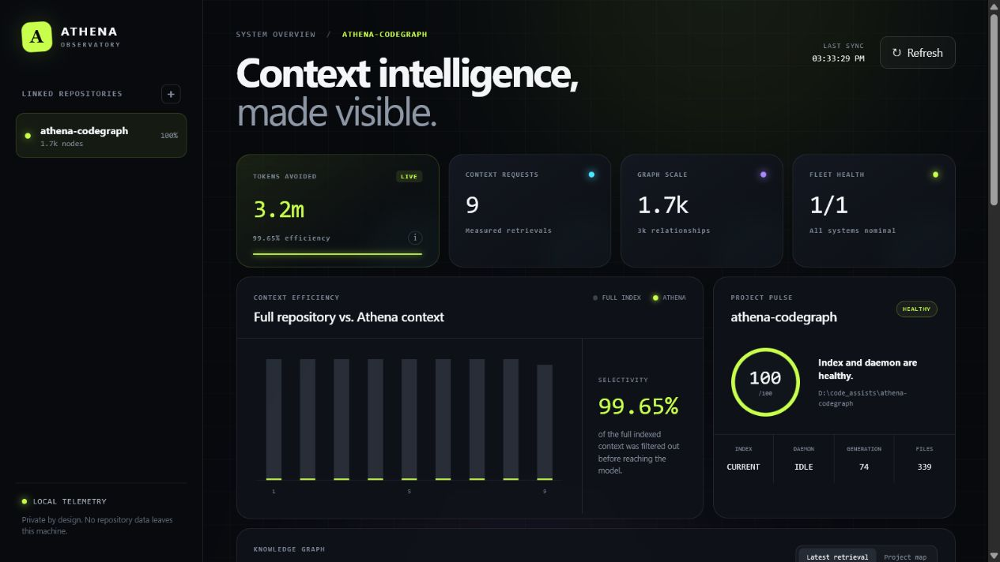
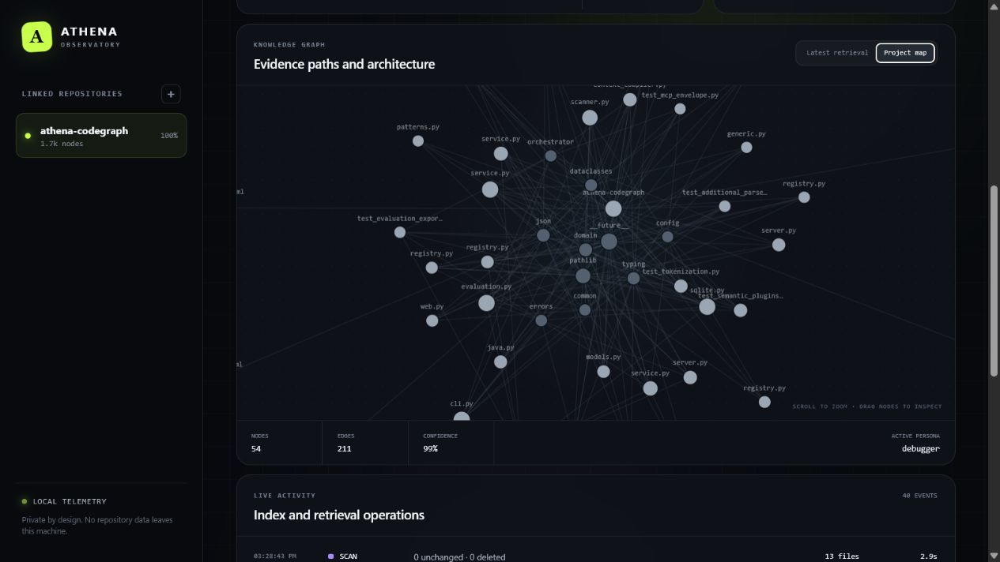

# Athena CodeGraph

**Local-first, evidence-backed repository intelligence for coding assistants.**

Athena turns a source repository into a searchable SQLite code graph and supplies a coding agent
with a small, persona-aware bundle of exact source evidence. It is designed for Codex, Claude Code,
GitHub Copilot, Cursor, VS Code, JetBrains, and any client that can launch an MCP STDIO server.

Instead of loading an entire framework or repository into every conversation, Athena retrieves the
symbols, source ranges, dependencies, endpoints, configuration, database objects, tests, and
architecture relationships that matter to the current task. It then enforces a hard context budget
over the serialized result.

> Athena helps an assistant find and understand relevant code. It does not replace compilation,
> tests, linters, migrations, security tooling, code review, or engineering judgment.

## Why Athena matters

Large repositories create a context problem for AI-assisted development:

- broad file exploration is slow and token-expensive;
- filenames alone do not explain calls, dependencies, endpoints, or database relationships;
- a model can miss relevant tests or configuration located in another module;
- static persona prompts consume context even when their guidance is irrelevant;
- stale indexes and unverified summaries can make confident answers unsafe.

Athena provides a local context layer that addresses those failure modes:

- **Evidence-backed retrieval:** every selected source chunk includes path and exact line range.
- **Typed code graph:** classes, methods, endpoints, tables, configuration keys, tests, personas, and
  other concepts are connected by evidence-carrying relations.
- **Hybrid ranking:** exact symbols, SQLite FTS5/BM25, graph traversal, and task/persona tags reinforce
  one another.
- **Hard token budgets:** Athena counts its deterministic output and removes lower-priority material
  until the result fits.
- **Specialist personas:** architecture, implementation, testing, debugging, security, database,
  cloud, DevOps, frontend, backend, mobile, Python, T3/T4, and other modes change retrieval policy,
  not just writing style.
- **Incremental indexing:** Git changes, file metadata, BLAKE2b hashes, scanner versions, and index
  generations minimize repeated work.
- **Local operation:** SQLite, graph traversal, default token counting, and the daemon run on your
  machine. No network is required for indexing or retrieval.
- **Secure defaults:** workspace containment, secret redaction, no arbitrary MCP command tool, and a
  hardened Docker profile.

The complete implementation guide—including hash inputs, graph derivation, ranking formulas,
SQLite schema, MCP projections, continuation tokens, daemon safety, and state layout—is in
[Athena CodeGraph: Technical Architecture and Operations Guide](docs/ATHENA_TECHNICAL_GUIDE.md).

## Feature overview

- Multi-language source discovery and parsing
- Java-specific and cross-language structural analysis
- SQL, configuration, environment-variable, and Markdown indexing
- Built-in cross-framework HTTP contract semantic plugin
- SQLite schema versioning, WAL, FTS5, and local metrics
- Stable BLAKE2b file/chunk/evidence/graph identities
- Raw and resolved graph relationships
- Symbol-aware and heading-aware overlapping chunks
- Persona routing and repository-local persona overrides
- Packaged, selectively indexed specialist knowledge
- Full and one-tool economy MCP modes
- Local multi-repository Observatory for health, token efficiency, activity, and graph traces
- Deterministic host-specific MCP result accounting
- Generic, OpenAI/tiktoken, Claude, and Copilot token accounting
- Opaque continuation tokens that invalidate when the index changes
- Native filesystem daemon with polling fallback
- Atomic status, diagnostics, heartbeat, and safe PID ownership checks
- Graph export to JSON, GraphML, and Mermaid
- Evaluation datasets, benchmarks, metrics, and release gates
- Native Windows/Linux/macOS and hardened Docker workflows

## Requirements

### Native Python

- Python 3.11 or newer
- Git recommended for the fastest incremental scans
- SQLite with FTS5 (included in standard current Python distributions)
- PowerShell examples below assume Windows; the same CLI works in other shells

### Docker

- Docker Engine or Docker Desktop with Compose v2
- No network access is required by the running Athena container

## Choose one runtime

Use **either native Python or Docker for a repository**, not both at the same time.

Native Python is recommended for daily Windows development because `watchfiles` can subscribe
directly to NTFS changes. Docker is useful for reproducible, isolated operation but may fall back to
polling across Windows bind mounts, which costs more idle CPU.

| Runtime | Best for | Repository | SQLite/state |
| --- | --- | --- | --- |
| Native venv | Daily development and lowest Windows overhead | Normal local path | `PROJECT/.athena/` |
| Docker | Reproducible isolated runtime | Read-only `/workspace` mount | Writable `/data` volume |

## Install from source with a virtual environment

Clone the repository and create the environment:

```powershell
git clone https://github.com/Yasserkb/ATHENA.git D:\code_assists\athena-codegraph
Set-Location D:\code_assists\athena-codegraph

py -3.12 -m venv .venv
.\.venv\Scripts\Activate.ps1

python -m pip install --upgrade pip
python -m pip install -e ".[mcp,tokenizers]"
```

For Athena development, install the test and quality dependencies too:

```powershell
python -m pip install -e ".[mcp,tokenizers,dev]"
```

Verify the installation:

```powershell
athena version
athena --help
```

If PowerShell blocks activation, either change the policy for the current process:

```powershell
Set-ExecutionPolicy -Scope Process -ExecutionPolicy Bypass
.\.venv\Scripts\Activate.ps1
```

or call the executable directly without activation:

```powershell
D:\code_assists\athena-codegraph\.venv\Scripts\athena.exe version
```

## Add Athena to a repository

The Athena executable can index any repository; Athena does not need to be copied into that project.
This example initializes a car-rental project using the Athena development venv:

```powershell
$athenaExe = "D:\code_assists\athena-codegraph\.venv\Scripts\athena.exe"
$projectRoot = "D:\code_assists\car-rental"

New-Item -ItemType Directory -Force -Path $projectRoot | Out-Null
Set-Location $projectRoot
git init

& $athenaExe init $projectRoot
& $athenaExe scan --root $projectRoot
& $athenaExe doctor --root $projectRoot
```

`athena init` creates:

- `.athena/config.yaml`;
- `.athena/personas/` for project overrides;
- `.athena/knowledge/` with packaged persona playbooks;
- `AGENTS.md` and thin Codex/Copilot/Cursor/VS Code/JetBrains adapters;
- `.athena/codex-mcp-config.toml`, a reviewable Codex snippet.

Add native runtime state to the target repository's `.gitignore`:

```gitignore
.athena/index.db
.athena/index.db-shm
.athena/index.db-wal
.athena/daemon/
.athena/cache/
.athena/logs/
```

Commit `.athena/config.yaml`, intentional local personas/knowledge, and agent instructions only when
they are part of the team's development policy.

## Native daily workflow

The daemon is a normal operating-system process. It stops when the PC shuts down. The MCP
`--daemon` option can start it, but a coding task may arrive before the first scan is finished. The
most reliable workflow is to start Athena and wait for `idle` before opening the coding assistant.

```powershell
$athenaExe = "D:\code_assists\athena-codegraph\.venv\Scripts\athena.exe"
$projectRoot = "D:\code_assists\car-rental"

& $athenaExe daemon start --root $projectRoot --wait-seconds 30
& $athenaExe daemon status --root $projectRoot
```

Ready status contains:

```text
state: idle
process_alive: true
process_matches_daemon: true
heartbeat_age_seconds: less than the configured timeout
```

`scanning` is not an error. Wait and run `daemon status` again. Once the daemon is idle, open the
target repository—not the Athena source checkout—as the Codex/IDE workspace.

Stop an unused repository daemon with:

```powershell
& $athenaExe daemon stop --root $projectRoot
```

Each repository has its own daemon and index. Stop daemons for projects you are not actively using
to minimize background work.

### Optional Windows readiness script

Save this as `start-athena.ps1` and adjust both paths:

```powershell
$athenaExe = "D:\code_assists\athena-codegraph\.venv\Scripts\athena.exe"
$projectRoot = "D:\code_assists\car-rental"
$deadline = (Get-Date).AddMinutes(5)

& $athenaExe daemon start --root $projectRoot --wait-seconds 30 | Out-Host

do {
    $status = & $athenaExe daemon status --root $projectRoot | ConvertFrom-Json
    Write-Host "Athena state: $($status.state)"

    if (
        $status.state -eq "idle" -and
        $status.process_alive -and
        $status.process_matches_daemon
    ) {
        Write-Host "Athena is ready." -ForegroundColor Green
        break
    }

    if ((Get-Date) -ge $deadline) {
        throw "Athena did not become ready within five minutes."
    }

    Start-Sleep -Seconds 2
} while ($true)

& $athenaExe doctor --root $projectRoot
```

Run it after logging in and before opening the project in your coding assistant.

## Native Codex MCP configuration

Create `PROJECT/.codex/config.toml`. Use an absolute executable path because Codex does not activate
your PowerShell venv automatically:

```toml
[mcp_servers.athena]
command = "D:/code_assists/athena-codegraph/.venv/Scripts/athena.exe"
args = [
  "mcp",
  "--root", "D:/code_assists/car-rental",
  "--mode", "economy",
  "--mcp-host", "codex",
  "--daemon",
]
cwd = "D:/code_assists/car-rental"

enabled = true
required = true
enabled_tools = ["repository_context"]
default_tools_approval_mode = "approve"
startup_timeout_sec = 30
tool_timeout_sec = 300
```

Replace the root and `cwd` for each project. Restart Codex after changing MCP configuration; an
existing task may retain the old STDIO process.

A useful first task is:

```text
Use repository_context once before broad exploration. Explain the architecture,
entry points, persistence boundaries, and test strategy of this repository.
```

## Docker installation and operation

Build the local image from the Athena repository:

```powershell
Set-Location D:\code_assists\athena-codegraph
docker compose build
```

Start the persistent Compose daemon:

```powershell
docker compose up -d
docker compose ps
docker compose exec -T athena athena daemon status --root /workspace
```

The expected service is `healthy`. During first startup, Athena may report `scanning`; wait for
`idle` before sending context requests.

Inspect the index and diagnostics:

```powershell
docker compose exec -T athena athena status --root /workspace
docker compose exec -T athena athena metrics --root /workspace
docker compose exec -T athena athena diagnostics --root /workspace --format text
docker compose logs --tail 100 athena
```

Stop Docker Athena without deleting the persistent index volume:

```powershell
docker compose down
```

Rebuild after source changes:

```powershell
docker compose build
docker compose up -d --force-recreate
```

The production layout is:

```text
/workspace             read-only repository
/data/index.db         SQLite graph index
/data/daemon/          PID, status, heartbeat, diagnostics, and logs
ATHENA_STATE_DIR=/data redirects all writable runtime state
```

No ports are exposed. MCP uses STDIO, so a coding client launches a separate interactive MCP
container/process rather than connecting to the detached daemon over TCP.

### Docker MCP example

For the Athena repository itself, an MCP client can launch a one-off STDIO container:

```powershell
docker compose run --rm -i athena `
  mcp --root /workspace --mode economy --mcp-host codex --daemon
```

Do not type this as a normal interactive application expecting a prompt; the process waits for MCP
protocol messages on STDIN. Configure the MCP client to launch it.

When targeting another repository with raw `docker run`, mount that repository read-only at
`/workspace` and provide a dedicated volume at `/data`. Do not reuse one writable Athena volume for
unrelated repositories.

## Athena Observatory

Athena Observatory is a private, local web control room for every repository registered with
Athena. It shows:

- index and daemon health, staleness, generation, and repository size;
- aggregate and per-project context requests;
- estimated tokens delivered and tokens avoided;
- cache hits, retrieval confidence, recent scans, and retrieval latency;
- the high-signal repository graph;
- the exact evidence subgraph selected for the latest recorded context request.

### Dashboard preview





Start it from the native virtual environment:

```powershell
Set-Location "D:\code_assists\athena-codegraph"
.\.venv\Scripts\Activate.ps1
athena observatory start --root "D:\code_assists\athena-codegraph"
```

The browser opens at [http://127.0.0.1:8765](http://127.0.0.1:8765). The server binds to the
loopback interface by default, adds no web-framework dependency, and does not transmit repository
data. Stop it with `Ctrl+C`.

Register more repositories before or while the dashboard is running:

```powershell
athena observatory add "D:\code_assists\car-rental"
athena observatory add "D:\code_assists\another-project"
athena observatory list
```

`athena init` also registers its repository automatically. The native registry is stored at
`~/.athena/observatory.json`. It contains paths and index locations, not source content. Override it
with `ATHENA_OBSERVATORY_STATE` or `--registry` when isolation is required.

Run the Observatory with Docker:

```powershell
docker compose --profile observatory up -d --build
docker compose --profile observatory ps
```

Then open [http://127.0.0.1:8765](http://127.0.0.1:8765). The Compose service is capped at 256 MB
and 0.5 CPU by default, uses the existing Athena data volume, publishes only to localhost, and runs
on an internal Docker network. The Docker dashboard observes the repository mounted through
`ATHENA_WORKSPACE`; native mode is the simplest choice for aggregating unrelated Windows paths.

### How token savings are calculated

For each completed context request, Athena records:

```text
estimated tokens avoided = full indexed repository estimate - delivered Athena context
```

The full-index baseline is calculated from indexed file byte sizes using Athena's provider-neutral
3.6 UTF-8-bytes-per-token estimator. File sizes are used instead of chunk sizes, so overlapping
chunks do not inflate the baseline. When an exact provider counter is configured, the delivered
context uses that measured value.

This number answers: “How much context did Athena avoid sending compared with sending the entire
indexed repository for this request?” It is a transparent counterfactual efficiency estimate, not
a provider invoice or guaranteed billing reduction. New requests also record their selected
evidence and architecture trace without storing the task text.

## Direct CLI usage

### Index and inspect

```powershell
athena scan --root PROJECT
athena status --root PROJECT
athena doctor --root PROJECT
athena diagnostics --root PROJECT --format text
athena metrics --root PROJECT
```

### Build context

```powershell
athena context `
  "Explain where bookings are validated and persisted" `
  --root PROJECT `
  --persona architect
```

Use the economy compiler directly:

```powershell
athena repository-context `
  "Where is authentication enforced?" `
  --root PROJECT `
  --persona security-analyst
```

### Inspect and export the graph

```powershell
athena graph BookingService --root PROJECT
athena export-graph athena-graph.json --root PROJECT --format json
athena export-graph athena-graph.graphml --root PROJECT --format graphml
athena export-graph athena-graph.md --root PROJECT --format mermaid
```

### Personas

```powershell
athena personas --root PROJECT
```

Built-ins include general workflow personas and specialists for architecture, implementation,
review, debugging, release, documentation, testing/QA, security, backend, frontend, database, data,
cloud, DevOps, mobile, Python, TypeScript, MERN, Spring/Angular, T3, and T4 development.

### Evaluate and benchmark

```powershell
athena eval examples/evalset.yaml --root examples/benchmark-fixture

athena benchmark benchmarks/representative.yaml `
  --root examples/benchmark-fixture `
  --scan `
  --mode economy `
  --gate
```

## MCP modes

Economy mode is recommended for coding agents:

```powershell
athena mcp --root PROJECT --mode economy --mcp-host codex --daemon
```

It exposes only:

```text
repository_context(query, persona?, continuation_token?)
```

Full mode is intended for debugging and rich clients:

```powershell
athena mcp --root PROJECT --mode full --mcp-host generic-mcp --daemon
```

It exposes scan, context, graph inspection, status, persona listing, diagnostics, persona resources,
and a task prompt.

MCP is STDIO. Starting `athena mcp` manually appears to “hang” because it is correctly waiting for
an MCP client's protocol input. Stop a manual session with `Ctrl+C`.

## Configuration

`athena init` writes `.athena/config.yaml`. See [config.example.yaml](config.example.yaml) for all
settings. Common adjustments include:

```yaml
index:
  max_file_bytes: 1000000
  chunk_lines: 80
  chunk_overlap_lines: 12
  parse_workers: 0
  secret_scan: true

retrieval:
  graph_depth: 2
  graph_max_nodes: 40
  min_score: 0.05

daemon:
  poll_interval_ms: 250
  debounce_ms: 500
  max_batch_delay_ms: 2000
  heartbeat_timeout_seconds: 10

mcp:
  mode: economy
  host: codex
  economy:
    max_context_tokens: 1400
    response_representation: compact-text-v1
```

On Windows native operation, keep the native watcher. If Athena must poll a large or remote
filesystem, increase `poll_interval_ms` to reduce idle CPU at the cost of slower change detection.

## Repository structure

```text
src/athena/
  application/       economy context compiler and continuations
  daemon/            watcher, PID, status, heartbeat, diagnostics
  domain/            graph, chunk, persona, and context models
  graph/             graph exporters
  indexing/          discovery, parsers, chunking, semantic plugins, derivation
  integrations/      generated assistant/IDE adapters
  mcp/               FastMCP STDIO server
  observatory/       local server, project registry, telemetry, and dashboard assets
  orchestrator/      runtime composition
  personas/          definitions, routing, policy graph, packaged knowledge
  retrieval/         hybrid ranking, packing, and hard-budget enforcement
  security/          workspace guard and secret detector
  storage/           SQLite schema, FTS5, graph traversal, metrics

tests/                executable behavior and regression coverage
examples/             evaluation, semantic, Java, and benchmark fixtures
benchmarks/           representative release-gate dataset
docker/               container health check
docs/                 authoritative technical guide
integrations/         example client configurations
```

## Develop and validate Athena

```powershell
Set-Location D:\code_assists\athena-codegraph
.\.venv\Scripts\Activate.ps1

python -m pytest -q
python -m ruff check src tests
python -m mypy src
python scripts/check_personas.py
python scripts/check_adapters.py
```

Build and validate the container:

```powershell
docker compose build
docker compose up -d --force-recreate
docker compose ps
docker compose exec -T athena athena doctor --root /workspace
```

## Troubleshooting

### `Transport closed` from Athena MCP

- If the project MCP command is `docker`, start Docker Desktop.
- If using a venv, make `command` the absolute path to `athena.exe` and remove Docker arguments.
- Confirm the command's arguments begin with `mcp`, not Docker's `run --rm -i` options.
- Restart the coding-assistant application after editing MCP configuration.

### `No such command 'run'`

The venv executable is being given Docker arguments. Correct:

```text
athena.exe mcp --root PROJECT --mode economy --mcp-host codex --daemon
```

Incorrect:

```text
athena.exe run --rm -i ...
```

### First repository-context call takes too long

Start the daemon before opening the assistant, wait for `idle`, and then create a new task:

```powershell
athena daemon start --root PROJECT --wait-seconds 30
athena daemon status --root PROJECT
```

### Daemon appears stale

```powershell
athena daemon stop --root PROJECT
athena daemon start --root PROJECT --wait-seconds 30
athena daemon status --root PROJECT
athena diagnostics --root PROJECT --format text
```

Healthy output has a live matching process, state `idle`, zero pending paths, and a fresh heartbeat.

### High Docker Desktop/WSL memory

Task Manager's `VmmemWSL` includes Docker's VM, engine, Linux filesystem cache, and all containers.
Use `docker stats --no-stream` to see Athena's actual container memory. Prefer native venv operation
on Windows for lower watcher overhead. Stop Docker state with:

```powershell
docker compose down
```

`wsl --shutdown` releases the entire WSL VM but also stops every WSL distribution and Docker.

### Database/index problems

Run:

```powershell
athena doctor --root PROJECT
athena status --root PROJECT
athena diagnostics --root PROJECT --format text
athena scan --root PROJECT
```

Do not delete `.athena/index.db` or a Docker volume unless rebuilding the index is acceptable. The
index is derived and recoverable, but deletion loses warm state and metrics.

## Security notes

- Athena reads only the configured workspace by default.
- MCP exposes no arbitrary command-execution tool.
- Likely private keys, AWS keys, GitHub tokens, and common secret assignments are redacted before
  source chunks are stored.
- Default token counting does not send repository content to a remote service.
- Optional remote Claude counting must be explicitly enabled and configured.
- Docker runs without network, without Linux capabilities, as a non-root user, with a read-only
  filesystem and bounded resources.

Secret redaction is not a substitute for a dedicated secret scanner. Keep credentials out of source
control and exclude sensitive files from Athena discovery.

## License

Athena CodeGraph is licensed under the [Apache License 2.0](LICENSE).

## Final operating checklist

For native daily work:

```text
Turn on PC
→ start the Athena daemon for the active repository
→ wait for state=idle
→ open that repository in Codex or the IDE
→ let the MCP client launch Athena economy mode
→ call repository_context once before broad repository exploration
```

For Docker daily work:

```text
Start Docker Desktop/Engine
→ docker compose up -d
→ wait for daemon state=idle and service=healthy
→ open the MCP client that launches the STDIO process
→ inspect with status, metrics, diagnostics, and logs as needed
```
