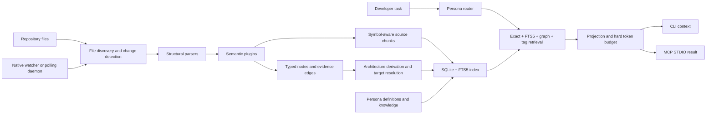

# Athena CodeGraph: Technical Architecture and Operations Guide

This document is the authoritative technical reference for Athena CodeGraph 0.1.x. It explains
what Athena is, why it exists, how repository files become an evidence-backed graph, how hashes
and identifiers remain stable, how retrieval and token budgeting work, how personas affect the
result, how MCP exposes Athena to coding assistants, and how the native and Docker runtimes are
operated.

For installation and day-to-day commands, start with the repository [README](../README.md).

## 1. Purpose and design principles

Coding assistants work best when they receive a small amount of correct, relevant source context.
Loading an entire repository wastes tokens, obscures relationships, increases latency, and can
encourage answers based on filenames or guesses rather than source evidence. Athena addresses that
problem with a local repository intelligence layer.

Athena follows these principles:

- **Local first.** Repository indexing, SQLite storage, graph traversal, lexical search, routing,
  and default token estimation happen locally.
- **Evidence first.** Retrieved facts point to a repository path and exact line range. Graph edges
  carry evidence, extractor identity, content hash, and confidence.
- **Bounded context.** A persona defines a maximum context budget. Athena accounts for the final
  serialized result and drops lower-value material until it fits.
- **Incremental work.** Git changes, file metadata, content hashes, scanner versions, and index
  generations prevent unnecessary reparsing and invalidate caches safely.
- **Provider neutrality.** The internal graph is independent of Codex, Copilot, Claude Code, or a
  specific model. Host-specific MCP result framing is accounted separately.
- **Read-only assistance.** Athena's MCP server does not expose arbitrary command execution. The
  default security policy restricts paths to the configured workspace and redacts likely secrets
  before indexing.

Athena is a context and navigation system. It does not replace compilers, tests, linters, database
migrations, security review, or human judgment.

## 2. System overview



The principal implementation areas are:

| Area | Responsibility | Source |
| --- | --- | --- |
| Configuration | Validated application settings and state paths | `src/athena/config.py` |
| Orchestration | Connects config, SQLite, scanner, personas, retrieval, and status | `src/athena/orchestrator/service.py` |
| Scanning | Discovery, incremental decisions, parsing, batching, and metadata | `src/athena/indexing/scanner.py` |
| Parsing | Java, generic languages, SQL, configuration, and semantic enrichment | `src/athena/indexing/parsers/`, `src/athena/indexing/semantic/` |
| Chunking | Symbol and Markdown-section source windows | `src/athena/indexing/chunker.py` |
| Graph derivation | Resolves external references and derives architecture patterns | `src/athena/indexing/patterns.py` |
| Storage | SQLite schema, FTS5, graph traversal, metrics, and caches | `src/athena/storage/sqlite.py` |
| Retrieval | Candidate fusion, ranking, packing, and token enforcement | `src/athena/retrieval/service.py` |
| Personas | Definitions, routing, policy graph, and packaged knowledge | `src/athena/personas/` |
| Context compiler | Economy projection and continuation state | `src/athena/application/context_compiler.py` |
| MCP | Full and economy STDIO servers | `src/athena/mcp/server.py` |
| Daemon | Watcher, heartbeat, PID ownership, status, and diagnostics | `src/athena/daemon/service.py` |
| Security | Workspace boundary and secret redaction | `src/athena/security/` |

## 3. Runtime lifecycle

### 3.1 Initialization

`athena init ROOT` creates `.athena/config.yaml`, a local persona directory, packaged persona
knowledge, and thin integrations for supported coding assistants. Built-in persona definitions stay
inside the Python package; repository-local definitions in `.athena/personas` can override or add
personas.

Initialization does not index the repository. `athena scan --root ROOT`, the daemon's initial scan,
or an MCP economy request made without a fresh daemon creates or refreshes the index.

### 3.2 Scan

A scan performs these stages:

1. Resolve and guard the repository root.
2. Load `.athena/config.yaml` or `.athena.yaml`, falling back to validated defaults.
3. Open SQLite, validate schema version 2, enable WAL, and initialize FTS5 tables.
4. Compute repository identity, configuration fingerprint, Git state, and scanner/deriver versions.
5. Select a clean-Git fast path, Git-diff incremental path, or filesystem-discovery path.
6. Filter ignored, unsupported, oversized, external, and Athena-runtime files.
7. Compare size and modification time with stored file metadata.
8. Read changed candidates, calculate a content hash, redact likely secrets, parse, enrich, and
   chunk the source.
9. Replace successful file analyses transactionally in batches. Failed paths retain diagnostics and
   mark the index degraded rather than silently becoming current.
10. Delete stale indexed files and clean orphaned external symbols.
11. Resolve raw external references, derive architecture relations, and update the persona graph.
12. Store scanner, deriver, commit, worktree, configuration, failure, and timing metadata.
13. Increment the index generation whenever indexed content changes, invalidating generation-bound
   caches.

### 3.3 Query

A context query routes the task to a persona, extracts exact terms, retrieves candidates through
multiple channels, combines their scores, applies the persona's graph and tag policy, removes weak
or redundant chunks, accounts the serialized payload, and returns only the evidence that fits.

## 4. File discovery and incremental indexing

### 4.1 Included files

The default configuration supports Java, Kotlin, Python, TypeScript/JavaScript, C#, Go, Rust, PHP,
Ruby, C/C++, Swift, Dart, YAML, properties, SQL, and Markdown. The default maximum file size is
1,000,000 bytes.

Discovery applies:

- the configured `exclude_globs`;
- repository `.gitignore` rules;
- supported extension checks;
- maximum file size;
- workspace containment after path resolution;
- special exclusion for `.athena` runtime content, except `.athena/knowledge/`.

The scanner uses `os.walk` and prunes ignored directories before entering them. This matters on
Docker Desktop and Windows/WSL bind mounts, where traversing `.git`, `.venv`, `node_modules`, and
cache trees is expensive even if their files are rejected later.

### 4.2 Git-aware paths

When Git metadata is available, Athena records the indexed commit and whether the worktree was
clean. A clean repository whose commit, configuration hash, scanner version, and deriver version
have not changed can return immediately without walking or hashing every source file.

When commits differ, Athena asks Git for changed and deleted paths. If a previously dirty worktree
becomes clean without a commit change, Athena validates hashes because Git can no longer identify
which dirty representation was previously indexed.

Without usable Git metadata, Athena remains functional and uses filesystem discovery, size/mtime
checks, and content hashing.

### 4.3 Metadata before hashing

Size and nanosecond modification time are the inexpensive first filter. A file whose stored size and
mtime match is treated as unchanged during a normal filesystem scan. A candidate whose metadata
changed is read and hashed. If its content hash still matches, only metadata is updated; parsing,
graph extraction, and chunk generation are skipped.

## 5. Hashing and stable identity

Athena uses BLAKE2b from Python's standard library. The hash functions are deterministic and local;
they are identifiers and change detectors, not passwords.

### 5.1 Content hashes

`content_hash(content)` computes BLAKE2b with a 16-byte digest and returns 32 hexadecimal
characters:

```text
content_hash = BLAKE2b(raw_bytes, digest_size=16).hex()
```

It is used for:

- complete file contents;
- individual chunk contents;
- evidence records;
- configuration and local-knowledge fingerprints;
- persona graph fingerprints;
- derived architecture evidence.

If secret scanning redacts a file, the `FileRecord` still identifies the original raw file hash,
while stored chunk content contains redacted text. Evidence produced by parsers receives the source
digest passed to the parser, making the indexed relationship traceable to the scanned version.

### 5.2 Stable IDs

`stable_id(prefix, *parts)` joins its parts with `::`, hashes the resulting UTF-8 string with a
10-byte BLAKE2b digest, and prefixes the 20 hexadecimal characters:

```text
raw       = part1::part2::part3
digest    = BLAKE2b(raw, digest_size=10).hex()
stable_id = prefix::digest
```

Stable IDs prevent database row identity from depending on insertion order. Chunk IDs include path,
line range, and content hash, so a material source or boundary change produces a new chunk identity.
Parsers use stable IDs for files, symbols, endpoints, configuration keys, migrations, and other
graph concepts where deterministic reconstruction is valuable.

External references intentionally use readable IDs such as
`external::<kind>::<qualified-name>`. Architecture derivation can later resolve those placeholders
to repository-owned nodes without erasing the raw observation.

### 5.3 Continuation tokens

Economy-mode continuation tokens are not content hashes. They are opaque, process-local identifiers.
The deterministic initial form uses HMAC-SHA256 over index generation, persona selection, and query,
with a per-process random secret. Tokens expire after the configured TTL and become invalid when the
index generation changes. They cannot be used to infer source contents.

## 6. Parsing, semantic enrichment, and chunks

### 6.1 Structural parsing

The parser registry selects an analyzer by extension:

- the Java parser extracts packages, types, methods, annotations, endpoints, imports, calls,
  inheritance, interfaces, configuration references, and dependency hints;
- the generic parser covers Python, JavaScript/TypeScript, Kotlin, C#, Go, Rust, PHP, Ruby, C/C++,
  Swift, and Dart using language-aware rules;
- the SQL parser identifies migrations, tables, references, and touched tables;
- the configuration parser identifies configuration keys and environment bindings;
- Markdown is indexed as source knowledge with heading-aware chunking.

Parsing produces nodes, edges, symbols, and warnings. Each edge includes path, line range, content
hash, extractor, and confidence.

### 6.2 Semantic plugins

Structural results can be enriched by versioned semantic plugins. The built-in
`builtin.web-contracts.v1` plugin recognizes server and client HTTP contracts across common
frameworks, including FastAPI/Flask/Django, Express/NestJS, ASP.NET Core, Go HTTP routers, Rust web
attributes, and JavaScript HTTP clients.

It normalizes routes, represents path parameters as `{}`, emits `EXPOSES_ENDPOINT`, `HANDLED_BY`,
and `CALLS_ENDPOINT`, and allows storage-time contract matching between a provider route and a
client route. Third-party plugins can register through the `athena.semantic_plugins` entry-point
group and must declare API version `1`.

Plugin failures become warnings; they do not discard the structural parse.

### 6.3 Symbol-aware chunking

Code chunks follow detected symbol body ranges. Large symbols are split into bounded windows using
`chunk_lines` and `chunk_overlap_lines`. Module-level lines not covered by a symbol are preserved in
their own windows. Chunks contain only original or redacted source text; Athena does not invent a
summary and store it as evidence.

Markdown chunks begin at headings, stay within heading sections, and split oversized sections with
the same overlap rules. Heading words become compact `section:<word>` tags.

Each chunk stores:

- stable chunk ID;
- relative path and exact start/end lines;
- content and content hash;
- optional owning symbol;
- language;
- language, layer, framework, symbol, and semantic tags.

## 7. The code and persona graph

### 7.1 Node model

The graph supports repository, package, file, class, interface, record, enum, method, annotation,
endpoint, configuration key, environment variable, database table, migration, test, pattern,
workflow, external symbol, persona, and persona-policy nodes. Parsers may add compatible string
kinds because the persisted schema stores the kind as text.

A node contains a deterministic ID, kind, simple name, qualified name, optional source path and line
range, and JSON metadata. Normalized name, qualified name, path, package, and simple-name fields are
materialized in SQLite for fast exact and FTS lookup.

### 7.2 Edge model

An edge is directional and typed. Common relations include:

- `CONTAINS`, `DEFINES`, and `HAS_MEMBER`;
- `IMPORTS`, `DEPENDS_ON`, `CALLS`, `EXTENDS`, and `IMPLEMENTS`;
- `ANNOTATED_WITH` and `CONFIGURED_BY`;
- `EXPOSES_ENDPOINT`, `HANDLED_BY`, and `CALLS_ENDPOINT`;
- `TOUCHES_TABLE` and `BINDS_ENV`;
- `TESTS` and `FOLLOWS_PATTERN`;
- `RESOLVED_*` relations derived from raw external references;
- persona relations such as `PERSONA_TRAVERSES`, `PERSONA_STARTS_FROM`, and
  `PERSONA_PRIORITIZES`.

Every persisted edge contains evidence path, start/end lines, content hash, extractor, confidence,
and metadata. The compound primary key prevents duplicate observations of the same relationship at
the same source location.

### 7.3 External references and resolved edges

Parsers do not assume that an imported or called name belongs to a repository symbol. They first
create an `external_symbol`. `ArchitectureDeriver` then attempts to resolve external targets against
repository nodes using normalized names, qualified names, packages, paths, and relation semantics.

Successful resolutions produce `RESOLVED_DEPENDS_ON`, `RESOLVED_CALLS`,
`RESOLVED_CALLS_ENDPOINT`, `RESOLVED_CONFIGURED_BY`, `RESOLVED_EXTENDS`, or
`RESOLVED_IMPLEMENTS`. Metadata preserves the original external target and raw evidence path.

Resolution confidence is higher for HTTP-contract matches and qualified names than for simple-name
matches. The raw edge remains available, so a derived result can be audited.

### 7.4 Derived architecture

The deriver adds repository containment, connects conventionally named tests to production symbols,
and recognizes a controller-service-repository pattern when resolved dependency layers support it.
Pattern nodes link members through `FOLLOWS_PATTERN` and `HAS_MEMBER` rather than storing a prose
claim with no graph structure.

Incremental derivation calculates affected owners from changed/deleted paths, prior derived
relationships, and reference owners. A deriver-version change forces a full rebuild.

### 7.5 Persona graph

Personas are also represented as graph nodes. Their allowed starting kinds, traversable relations,
and preferred tags become policy nodes and edges. This makes retrieval policy inspectable and
exportable with the code graph rather than hiding it only in prompt text.

## 8. SQLite storage

The default local database is `.athena/index.db`. When `ATHENA_STATE_DIR` is set, it becomes
`<state-directory>/index.db`.

SQLite uses foreign keys, WAL journaling, `synchronous=NORMAL`, and a 5-second busy timeout. Schema
version 2 contains:

| Table | Purpose |
| --- | --- |
| `metadata` | Schema, repository, commit, scanner, deriver, generation, and health metadata |
| `files` | File path, hash, size, mtime, language, and indexed timestamp |
| `nodes` | Typed graph nodes and normalized search columns |
| `edges` | Evidence-backed typed graph relationships |
| `chunks` | Exact source windows connected to optional symbols |
| `chunks_fts` | Unicode FTS5 index over path, symbol, tags, and content |
| `nodes_fts` | Search index over normalized node identity fields, created/migrated by storage code |
| `metrics` | Scan/context duration, token, result-count, and JSON operation payloads |

File replacement deletes the previous file-owned representation and inserts the new nodes, edges,
chunks, and FTS rows transactionally. Global persona and derived nodes have separate replacement
paths so one file update does not erase repository-wide graph information.

The `index_generation` metadata value is part of exact-search, lexical-search, graph-walk, and
context-bundle cache keys. When generation changes, stale cached results are no longer reused.

## 9. Retrieval and ranking

Athena fuses independent retrieval channels rather than relying on one search method.

### 9.1 Query terms

Exact graph seeds come from path/symbol-like task terms after stopword removal. Broad camel-case
expansion is deliberately excluded from exact seeding to reduce unrelated graph starts. FTS5 uses
Unicode tokens and supports identifiers and natural-language source text.

### 9.2 Exact node retrieval

Normalized node matching assigns these principal scores:

- exact name or qualified name: `1.00`;
- exact simple name: `0.95`;
- name prefix: `0.85`;
- qualified-name prefix: `0.80`;
- path/other accepted match: `0.72`.

Node FTS5 provides a fallback when direct normalized matching does not fill the limit. Persona
`start_kinds` constrain seeds when matching nodes of preferred kinds exist; otherwise Athena falls
back gracefully to the unfiltered exact candidates.

### 9.3 Lexical chunk retrieval

`chunks_fts` uses FTS5 BM25 with weighted path, symbol, tags, and content columns. The lower-is-better
BM25 value is normalized to `rank / (1 + rank)`. Retrieval then combines rank position and normalized
BM25:

```text
reciprocal = 1 / sqrt(rank_position)
lexical    = min(0.88, 0.35 + 0.35 * reciprocal + 0.25 * normalized_bm25)
```

### 9.4 Graph expansion

Exact node IDs seed a bidirectional breadth-first graph walk. The persona restricts relation types;
configuration bounds depth and total graph nodes. A chunk reached at graph distance `d` receives:

```text
graph_score = 0.64 / max(1, d)
```

### 9.5 Tag boosts and score fusion

Task words produce tags for tests, configuration, database/migrations, endpoints, and documentation.
A matching task tag contributes `0.48`; a matching persona-preferred tag contributes `0.20`.

When the same chunk appears through several channels, Athena uses probabilistic OR:

```text
combined_score = 1 - product(1 - clamp(channel_score, 0, 0.99))
```

Agreement therefore raises confidence without simply adding scores above 1.0.

The dynamic threshold is the larger of configured `min_score` and up to 40% of the best candidate,
capped at `0.45`. This adapts to strong and weak result sets.

### 9.6 Diversity and evidence levels

Packing enforces the persona's maximum chunks per file and rejects chunks whose line overlap is at
least 55% of an already selected chunk. The best source chunk remains complete. Secondary code
evidence is compressed to a leading exact 14-line range; YAML, properties, and SQL evidence remains
complete because small configuration details are often decisive. Compression is labeled in the
retrieval reasons.

The first oversized candidate may be truncated to fit when no other evidence has been selected.
Truncation markers are explicit.

### 9.7 Retrieval confidence

Final confidence blends route confidence and the top evidence score:

```text
confidence = min(1, 0.25 * persona_route_confidence + 0.75 * top_evidence_score)
```

Warnings identify missing exact matches, empty evidence, low confidence, and missing test evidence.
Consumers should still inspect exact source before high-risk edits.

## 10. Personas and knowledge

Persona YAML files define:

- identity and purpose;
- trigger phrases;
- concise behavioral rules and output expectations;
- preferred graph start kinds;
- traversable relations;
- preferred tags;
- context-token budget;
- per-file chunk limit;
- graph depth.

The registry loads packaged definitions first and repository-local YAML files afterward, so local
files can override built-ins by ID. A valid effective registry must contain `developer`.

Routing counts boundary-aware trigger matches and task-intent signals. Specialist personas receive
an additional boost when their domain triggers match. Strong delivery intents such as review,
testing, debugging, documentation, and release receive priority over incidental framework terms.
When nothing matches, Athena uses `developer` with zero route confidence.

Persona prompt cards include purpose, at most four rules, and output expectations. The full
playbooks are installed into `.athena/knowledge/<persona>/` and indexed as retrievable Markdown,
keeping static prompt overhead small while allowing task-relevant specialist knowledge to surface.

Retrieval profiles adjust the effective policy:

- `economy` / `copilot-economy`: at most 1,200 tokens, one chunk per file, graph depth at most 1;
- `eco`: at most 1,800 tokens, two chunks per file, graph depth at most 1;
- `balanced`: persona defaults;
- `deep`: at least 6,000 tokens, at least four chunks per file, graph depth at least 3;
- `auto`: chooses deep for architecture/workflow/migration tasks, eco for short symbol questions,
  and balanced otherwise.

## 11. Token counting and hard budgets

Athena distinguishes a fast internal estimate from a provider count:

- generic estimate: `ceil(UTF-8 bytes / 3.6)`;
- OpenAI: local `tiktoken`, using a model encoding when known or configured `o200k_base`;
- Claude: local estimate by default, with optional remote Anthropic count only when explicitly
  enabled, a target model is provided, and the configured API-key environment variable exists;
- Copilot: delegates to the configured/auto-detected model family and can estimate input AI-credit
  usage when pricing is configured.

The budget covers Athena's deterministic serialized result boundary. For MCP this includes the
known `CallToolResult` content generated by Athena. Private host instructions, conversation history,
model framing, JSON-RPC IDs, and host-side transformations are outside Athena's measurable scope and
are not falsely claimed as counted.

Budget enforcement repeatedly serializes and counts the current projection. If it is too large,
Athena removes evidence from the end, then architecture lines, then truncates task text. If framing
alone cannot fit, it raises `TokenBudgetError`. The returned usage reports estimated/provider/exact
tokens, hard and remaining budget, serialized/accounted bytes, dropped evidence, tokenizer source,
and host-envelope overhead estimate.

Bounded LRU caches store estimates and provider counts keyed by tokenizer identity and exact text.

## 12. Context projections and continuations

The full projection contains repository, task, persona card, architecture, token-accounting fields,
warnings, and evidence.

Economy mode emits `athena-context-economy-v1` with a compact contract:

- version;
- selected persona and confidence;
- evidence path, line range, score, reasons, and content;
- token usage, budget, remaining capacity, dropped count, and accounting scope;
- optional architecture, warnings, continuation token, and refresh count.

`compact-text-v1` places one canonical compact JSON copy in MCP text content. The compatibility
representation can expose structured content but duplicates more framing.

A continuation reuses the original query and persona, excludes previously returned chunk IDs, and
adds the new continuation focus. Continuation state is in memory, expires after the configured TTL,
and is rejected after an index-generation change.

## 13. MCP architecture

Athena uses the official MCP Python SDK and `FastMCP` over **STDIO**. It does not expose an HTTP
port in the default runtime. An MCP client launches the configured process and exchanges messages
through standard input/output.

### 13.1 Economy mode

Economy mode exposes one tool:

```text
repository_context(query, persona?, continuation_token?)
```

Copilot compatibility mode exposes the same concept as `athena_context(task, persona?)`. Economy
mode is intended for coding agents that should call Athena once before broad repository exploration,
reuse returned evidence, and continue only when necessary.

Before compiling context, the economy compiler checks daemon freshness. If no fresh daemon exists,
it performs a synchronous incremental scan. This guarantees freshness but means the first request
after a reboot can be slower; starting the daemon and waiting for `idle` before opening the coding
assistant avoids that cold-start race.

### 13.2 Full mode

Full mode exposes:

- `athena_scan_repository`;
- `athena_build_context`;
- `athena_inspect_graph`;
- `athena_status`;
- `athena_list_personas`;
- `athena_diagnostics`;
- persona resources and an `athena_task` prompt.

Full mode is useful for debugging and interactive exploration. Economy mode is the recommended
default agent surface because it is smaller and easier to use correctly.

### 13.3 Host accounting

Supported host labels are `generic-mcp`, `vscode-copilot`, `jetbrains-copilot`, `claude-code`, and
`codex`. The label selects deterministic result-envelope accounting; it does not transmit repository
data to that provider.

## 14. Persistent daemon

The daemon keeps the index current between requests.

### 14.1 States

Status is written atomically and includes schema version, state, PID, repository root, startup and
heartbeat timestamps, watcher settings, pending/event/scan counts, last scan, last error, and
diagnostics path. Important states are:

- `scanning`: initial or incremental scan is in progress;
- `idle`: healthy and no coalesced changes are pending;
- `pending`: changes are waiting for debounce/max-delay flush;
- `degraded`: the latest scan failed and is scheduled for retry;
- `stopped`: graceful shutdown completed.

### 14.2 Native watching and polling

When `watchfiles` is available, Athena subscribes to the repository and filters irrelevant paths.
Events are debounced and bounded by a maximum batch delay. On native-watcher failure—including
permission failures caused by read-only bind mounts—Athena records diagnostics and switches to a
portable polling watcher.

Polling compares `(size, mtime_ns)` snapshots over the exact indexable file set. The initial
snapshot is deferred until after the daemon publishes `scanning`, so a large repository never looks
like an old stopped daemon while startup discovery runs.

### 14.3 PID ownership and restart safety

PID files persist across process and container lifetimes, so `kill(pid, 0)` alone is unsafe: an
unrelated process can reuse the number. On POSIX, Athena reads `/proc/<pid>/cmdline` and recognizes
both `python -m athena.cli daemon run` and the installed `athena daemon run` console entry point.
Status must also be in an active state and the PID file must exist.

Container runtimes frequently reuse low PIDs. A foreground daemon may reclaim a persisted lock that
contains its own newly assigned PID because it has not acquired that lock yet; a different verified
live daemon remains protected.

Freshness additionally requires `idle`, zero pending paths, a live process, valid ownership, and a
heartbeat age within `heartbeat_timeout_seconds`.

## 15. Native and Docker state layout

### 15.1 Native layout

Without `ATHENA_STATE_DIR`, runtime state is repository-local:

```text
PROJECT/
  .athena/
    config.yaml
    index.db
    index.db-wal
    index.db-shm
    daemon/
      daemon.pid
      status.json
      diagnostics.json
      daemon.log
    knowledge/
    personas/
```

Database and daemon files should normally be ignored by Git. Configuration, intentional local
personas, and selected knowledge may be committed when they form part of the project's development
policy.

### 15.2 Docker layout and `ATHENA_STATE_DIR`

The production container mounts the repository read-only at `/workspace` and a writable volume at
`/data`. `ATHENA_STATE_DIR=/data` redirects:

```text
SQLite:       /data/index.db
Daemon state: /data/daemon/
Repository:   /workspace (read-only)
```

This separation is fundamental: SQLite WAL/SHM files, PID files, heartbeats, diagnostics, caches,
and temporary atomic writes never need permission to modify the source checkout.

The container runs as UID/GID 10001, drops all capabilities, enables `no-new-privileges`, uses a
read-only root filesystem, disables networking, bounds PIDs/CPU/memory, and provides a small `/tmp`
tmpfs. The health check verifies workspace access, state-volume write access, SQLite quick-check,
daemon process identity, and active daemon state.

Docker Compose runs `athena daemon run --root /workspace` as the foreground service. MCP remains a
separate STDIO process launched by its client; a detached Compose service cannot itself provide a
client's STDIO session.

## 16. Security and privacy

Default security settings are:

```yaml
security:
  restrict_to_workspace: true
  allow_command_execution: false
  redact_secrets: true
```

`WorkspaceGuard` resolves paths and rejects any path outside the configured root. The secret
detector recognizes private-key blocks, AWS access keys, GitHub token shapes, and common
password/secret/API-key/token assignments. Matches are replaced with typed redaction markers before
chunks are stored.

Redaction is defense in depth, not a complete secret scanner. Repositories should still exclude
credential files and use dedicated secret-management tooling. Optional remote Claude token counting
can send the serialized context to Anthropic and therefore remains disabled unless explicitly
enabled. OpenAI/tiktoken and generic counting are local.

MCP tools are repository-scoped and expose no arbitrary shell execution. The daemon reads source
and writes only Athena state.

## 17. Caches, metrics, and evaluation

Thread-safe bounded LRU caches cover parsed analyses, exact nodes, lexical chunks, graph walks,
context bundles, persona cards, estimates, and provider counts. Cache status reports hits, misses,
hit rate, entries, evictions, invalidations, approximate Python object bytes, and average saved
compute time.

SQLite metrics record scan/context duration, estimated/provider tokens, result counts, and
operation-specific payloads. `athena metrics` summarizes recent operations.

Evaluation tooling measures persona routing, path precision/recall, reciprocal rank, latency, and
context size. Benchmarks support cold/warm paths, full/economy modes, output reports, and configured
release gates. Graph export supports JSON, GraphML, and Mermaid.

## 18. Configuration reference

The complete example is `config.example.yaml`. Important groups are:

- `index`: database, file size, chunking, workers, batching, extensions, ignores, and redaction;
- `retrieval`: exact/lexical limits, graph depth/size, threshold, and cache bounds;
- `tokenization`: provider, model, encoding, remote Claude policy, and Copilot accounting;
- `security`: workspace, command, and redaction policy;
- `personas`: repository-local definition directories;
- `telemetry`: local metric behavior; task text is not stored by default;
- `daemon`: polling, debounce, batch delay, and heartbeat timeout;
- `semantic`: plugin enablement and entry-point loading;
- `mcp`: host, mode, economy projection, representation, budget, and continuation TTL.

Configuration is validated with Pydantic and rejects unknown or out-of-range values. A relative
`ATHENA_STATE_DIR` is rejected because ambiguous external state would undermine container isolation.

## 19. Extension points

To extend Athena safely:

1. **Language/parser support:** implement the parser protocol, emit deterministic nodes/edges and
   source evidence, register extensions, and add fixture tests.
2. **Semantic plugin:** implement API version `1`, declare supported extensions, preserve structural
   results, and register through `athena.semantic_plugins` or configuration.
3. **Persona:** add validated YAML with a focused retrieval policy; put long knowledge in indexed
   Markdown rather than an oversized prompt card.
4. **Graph relation:** emit a raw evidence-backed relation first; add derivation only when target
   resolution can be explained and tested.
5. **MCP projection:** keep one canonical payload, account the exact Athena-controlled serialization,
   and add envelope/token regression tests.
6. **Schema change:** increment the schema version and implement an explicit migration or a clear
   compatibility error.

## 20. Operational troubleshooting

### Cold context request is slow

Start the daemon before the coding assistant and wait for `state: idle`:

```powershell
athena daemon start --root PROJECT --wait-seconds 30
athena daemon status --root PROJECT
```

The MCP `--daemon` flag ensures a daemon exists, but the first context call can still race an initial
scan. Prestarting removes that race.

### Daemon reports `stopped` or stale heartbeat

```powershell
athena daemon stop --root PROJECT
athena daemon start --root PROJECT --wait-seconds 30
athena diagnostics --root PROJECT --format text
```

Confirm `process_alive`, `process_matches_daemon`, and heartbeat age in `daemon status`.

### Docker uses more host resources than expected

Use `docker stats` to separate container memory from Docker Desktop/WSL memory. Polling across a
Windows bind mount costs more CPU than native Windows `watchfiles`; prefer the venv runtime for daily
Windows development. Do not run native and Docker daemons for the same repository simultaneously.

### MCP transport closes

MCP is STDIO. If a project configuration launches `docker`, Docker Desktop must be running. For a
native configuration, point `command` directly at the Athena venv executable and remove all Docker
arguments. Restart the coding-assistant application after changing MCP configuration because an
existing task may retain the old process transport.

### Index is degraded

Check `failed_paths` and diagnostics, fix permissions/decoding/parser problems, then run:

```powershell
athena scan --root PROJECT
athena status --root PROJECT
```

Athena advances current scan metadata only when file parsing has no failures.

## 21. Verification commands

```powershell
athena doctor --root PROJECT
athena scan --root PROJECT
athena status --root PROJECT
athena daemon status --root PROJECT
athena metrics --root PROJECT
athena personas --root PROJECT
athena graph SYMBOL --root PROJECT
athena repository-context "Explain this workflow" --root PROJECT --persona architect
```

For development of Athena itself:

```powershell
python -m pytest -q
python -m ruff check src tests
python -m mypy src
python scripts/check_personas.py
python scripts/check_adapters.py
```

The tests are the executable contract. When this guide and behavior differ, verify the exact current
source and tests before changing production behavior.
